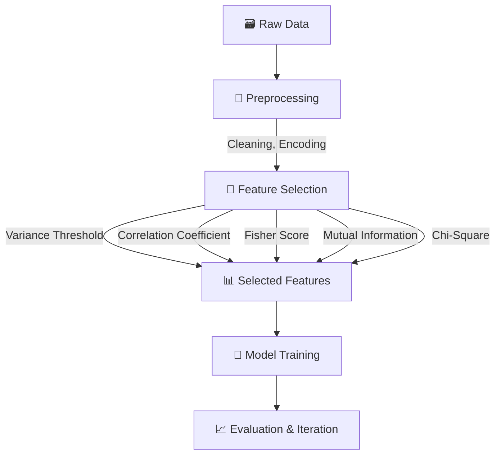

# 🚀 Feature Engineering Techniques Repository

Welcome to the **Feature Engineering Techniques** repository! This collection of Jupyter Notebooks explores various **feature selection and extraction** methods — excluding dimensionality reduction algorithms like PCA. Each notebook provides theory, implementation, and visualizations to support machine learning practitioners, data scientists, and MLOps engineers in enhancing model performance through effective feature engineering.

---

## 📖 Overview

Feature Engineering is the art of transforming raw data into meaningful inputs for machine learning models. This process improves accuracy, reduces overfitting, speeds up computation, and enhances model interpretability.

### 🎯 Key Benefits:
- ✅ **Improved Accuracy** – by using only informative features.
- 🧠 **Reduced Overfitting** – by removing noise and redundancy.
- ⚡ **Faster Computation** – fewer features, faster training.
- 🧾 **Better Interpretability** – clearer insights from clean features.

---

## 📂 Available Notebooks

| Technique | Description | File | Key Concepts |
|----------|-------------|------|--------------|
| 📉 **Variance Threshold** | Removes features with low variance | `variance_threshold.ipynb` | Variance filtering, low-information detection |
| 🔁 **Correlation Coefficient** | Eliminates highly correlated features | `correlation_coefficient.ipynb` | Pearson correlation, redundancy removal |
| 🧪 **Fisher Score** | Ranks features by discriminative power | `fisher_score.ipynb` | Feature ranking, class separation |
| 🔐 **Mutual Information (Classification)** | Selects features with dependency on class labels | `mutual_info_classification.ipynb` | Info gain, classification tasks |
| 🔍 **Mutual Information (Regression)** | Adapts MI for regression | `mutual_info_regression.ipynb` | Continuous target handling |
| 🧮 **Chi-Square Test** | Selects categorical features based on relevance | `chi_square.ipynb` | Statistical test, categorical analysis |

📌 _Stay tuned for RFE, Boruta, and more!_

---

## 🔄 Feature Engineering Pipeline



### 🔎 Steps Explained:
- **Preprocessing**: Handle nulls, encode categoricals, normalize.
- **Selection**: Apply statistical or information-based techniques.
- **Model Training**: Train with filtered features.
- **Evaluation**: Iterate based on performance.

---

## ⚙️ Getting Started

### 📦 Prerequisites
- Python `3.8+`
- Jupyter Notebook / JupyterLab
- Packages (see `requirements.txt`)

### 🧑‍💻 Installation
```bash
# Clone the repository
git clone https://github.com/your-username/feature-engineering-techniques.git
cd feature-engineering-techniques

# Create and activate virtual environment
python -m venv venv
source venv/bin/activate    # On Windows: venv\Scripts\activate

# Install dependencies
pip install -r requirements.txt

# Launch notebooks
jupyter notebook
```

---

## 📜 Requirements

The following Python packages are used:
```txt
pandas==2.0.3
numpy==1.24.3
scikit-learn==1.2.2
polars==0.20.3
matplotlib==3.7.1
seaborn==0.12.2
jupyter==1.0.0
```

Install them via:
```bash
pip install -r requirements.txt
```

---

## 📊 Usage Instructions

Each notebook includes:
- 🧠 **Introduction & Theory**
- 💻 **Python Implementation**
- 📉 **Graphs & Visualizations**
- 📂 **Example Dataset Use**

👉 Steps:
1. Launch the notebook in Jupyter.
2. Execute cells sequentially.
3. Customize datasets/parameters if needed.

---

## 🌱 Future Plans

- 📌 Add RFE, Boruta, and L1-based selection
- 🌐 Integrate **real-world datasets**
- 📊 Track experiments using **MLflow**
- 🚢 Deployment tutorials for production-ready features

---

## 🤝 Contributing

We welcome contributions!

### To Contribute:
1. 🍴 Fork this repo.
2. 🔀 Create a new branch: `git checkout -b feature/your-feature-name`
3. ✍️ Add a new notebook or enhance existing ones.
4. 📩 Submit a pull request with a meaningful description.

🧾 _Please follow the notebook format:_
- Introduction
- Theory
- Implementation
- Visualizations

---

## 📬 Contact

For questions, ideas, or feedback:
- 🐛 [GitHub Issues](https://github.com/your-username/feature-engineering-techniques/issues)
- 📧 your.email@example.com

---

## ⚖️ License

This project is licensed under the **MIT License** – see the [LICENSE](./LICENSE) file for details.

---

### 🎉 Happy Feature Engineering!

> “Feature engineering is the key to unlocking the full potential of your models.”  
> — Anonymous